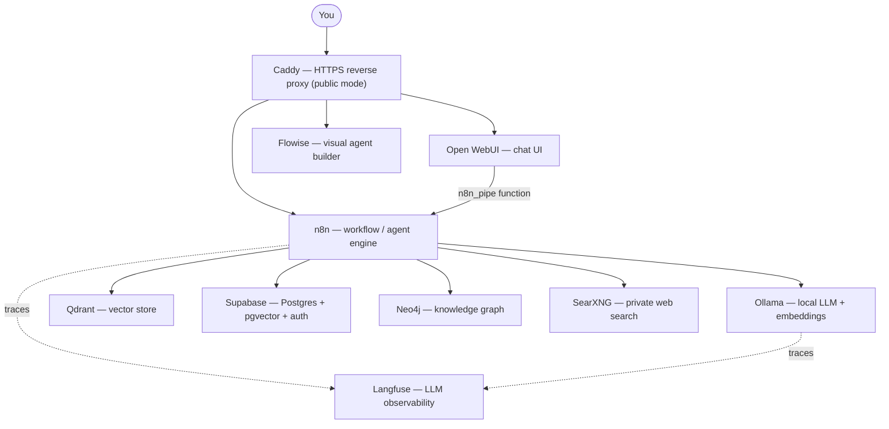

# Local AI Package

**A self-hosted, Docker-based AI development stack you can launch with one click.**

This is a fork of Cole Medin's [Self-hosted AI Package](https://github.com/coleam00/local-ai-packaged)
(itself based on the [n8n Self-hosted AI Starter Kit](https://github.com/n8n-io/self-hosted-ai-starter-kit)),
with an added **one-click launcher** that generates your secrets, checks Docker,
starts every service, monitors health, and opens the right browser tabs for you.

It bundles everything you need to build local, private AI workflows and agents —
low-code automation (n8n), a chat UI (Open WebUI), local LLMs (Ollama), a database
and vector store (Supabase + Qdrant), a knowledge graph (Neo4j), private web search
(SearXNG), and LLM observability (Langfuse) — all wired together and reachable over a
single Docker network. Nothing leaves your machine unless you tell it to.

---

## What's included

| Service | Role | Local URL |
|---|---|---|
| **[n8n](https://n8n.io/)** | Low-code workflow / AI-agent engine (400+ integrations) | http://localhost:5678 |
| **[Open WebUI](https://openwebui.com/)** | ChatGPT-style UI for local models and n8n agents | http://localhost:8080 |
| **[Ollama](https://ollama.com/)** | Runs local LLMs and embedding models | http://localhost:11434 |
| **[Supabase](https://supabase.com/)** | Postgres database, `pgvector` store, and auth | http://localhost:54323 |
| **[Qdrant](https://qdrant.tech/)** | High-performance vector store for RAG | http://localhost:6333 |
| **[Neo4j](https://neo4j.com/)** | Knowledge graph for GraphRAG / LightRAG / Graphiti | http://localhost:7474 |
| **[Flowise](https://flowiseai.com/)** | No/low-code visual agent builder | http://localhost:3001 |
| **[SearXNG](https://searxng.org/)** | Private metasearch engine (no tracking) | http://localhost:8081 |
| **[Langfuse](https://langfuse.com/)** | LLM engineering & agent observability | http://localhost:3000 |
| **[Caddy](https://caddyserver.com/)** | Managed HTTPS / reverse proxy for production | ports 80 / 443 |

On first boot Ollama automatically pulls **`qwen2.5:7b-instruct-q4_K_M`** (chat) and
**`nomic-embed-text`** (embeddings). Langfuse runs on its own dedicated Postgres,
ClickHouse, MinIO, and Redis/Valkey containers.

Three ready-made RAG agent workflows are imported into n8n on startup:

- `V1_Local_RAG_AI_Agent` — basic RAG with document ingestion
- `V2_Local_Supabase_RAG_AI_Agent` — RAG backed by Supabase vector storage
- `V3_Local_Agentic_RAG_AI_Agent` — agentic RAG with tool use

---

## How it works

Everything runs under one Docker Compose project (`localai`) on a shared network, so
services address each other by container name (`ollama:11434`, `db:5432`, `qdrant:6333`).
You interact through **Open WebUI** or the **n8n editor**; n8n orchestrates the LLM,
vector stores, graph, and search; Langfuse observes; Caddy fronts it all in production.



The Supabase stack is not vendored into this repo — `start_services.py` clones it via a
sparse checkout on first run, copies your `.env` into it, and brings it up **before** the
AI services so Postgres is ready when n8n starts.

---

## Prerequisites

- **[Docker / Docker Desktop](https://www.docker.com/products/docker-desktop/)** — runs every service
- **[Python 3.8+](https://www.python.org/downloads/)** — runs the launcher and start scripts
- **[Git](https://git-scm.com/)** — used to clone this repo and the Supabase stack

---

## Quickstart

### Option A — One-click launcher (recommended)

The launcher checks Docker, generates a complete `.env` with secure random secrets,
starts everything, waits for each service to come up, and opens your browser tabs.

**Windows**
```bat
:: GUI launcher (double-click also works)
START_LOCAL_AI.bat

:: or explicitly
python launcher.py
```

**Mac / Linux**
```bash
./start_local_ai.sh
# or
python3 launcher.py
```

**Launcher flags**
```bash
python launcher.py                          # GUI mode (default when tkinter is present)
python launcher.py --cli                    # headless CLI mode
python launcher.py --cli --profile gpu-nvidia
python launcher.py --cli --no-browser       # don't auto-open browser tabs
```

Generated secrets are written to `.env` and a human-readable copy is saved to
`credentials.txt` — **store these in a password manager and never commit them.**

### Option B — Manual start

If you'd rather manage `.env` yourself, copy `.env.example` to `.env`, fill in the
required secrets (n8n keys, Supabase secrets, Neo4j auth, Langfuse credentials — see the
comments in the file), then run the start script with the profile that matches your hardware:

```bash
python start_services.py --profile gpu-nvidia   # Nvidia GPU
python start_services.py --profile gpu-amd       # AMD GPU (Linux)
python start_services.py --profile cpu           # CPU only
python start_services.py --profile none          # use an Ollama you run outside Docker
```

Add `--environment public` to lock down every port except 80/443 (see [Production](#production-deployment)).
`--environment private` (the default) binds service ports to `127.0.0.1` for local access.

---

## First-time setup in the apps

1. Open **n8n** at http://localhost:5678 and create your local owner account (local only — not an n8n.io account).
2. Open the imported workflow, create credentials for the services it uses:
   - **Ollama** → `http://ollama:11434`
   - **Postgres (Supabase)** → host is **`db`** (not `localhost`), with the DB/user/password from `.env`
   - **Qdrant** → `http://qdrant:6333` (any API key works locally)
3. Run the workflow, then toggle it **Active** and copy its **Production** webhook URL.
4. Open **Open WebUI** at http://localhost:8080 and create your local account.
5. Go to **Workspace → Functions → Add Function**, paste in `n8n_pipe.py`, and set its
   `n8n_url` to the production webhook URL from step 3. Your n8n agent now appears as a
   model in Open WebUI's dropdown.

---

## Production deployment

For a public server, Caddy provides automatic HTTPS via Let's Encrypt and becomes the
only exposed surface:

1. Set your subdomain hostnames and `LETSENCRYPT_EMAIL` in `.env` (see the Caddy section
   of `.env.example`) and point DNS `A` records at your server.
2. Open only the web ports and start in public mode:
   ```bash
   ufw allow 80 && ufw allow 443 && ufw reload
   python3 start_services.py --profile gpu-nvidia --environment public
   ```

In public mode all service ports are closed and traffic is routed through Caddy on 443
(`Caddyfile` maps each subdomain to its container). Note that Docker publishes ports
below the ufw layer — keep all traffic on 443 through Caddy.

---

## Upgrading

`start_services.py` restarts containers but does **not** update them. To pull the latest images:

```bash
docker compose -p localai -f docker-compose.yml --profile <profile> down
docker compose -p localai -f docker-compose.yml --profile <profile> pull
python start_services.py --profile <profile>
```

Replace `<profile>` with `cpu`, `gpu-nvidia`, `gpu-amd`, or `none`.

---

## Project structure

```
local-ai-packaged/
├── launcher.py                       # one-click launcher (GUI + CLI, secret gen, health monitor)
├── start_services.py                 # clones Supabase, then boots Supabase + AI stacks
├── START_LOCAL_AI.bat / .ps1         # Windows entry points
├── start_local_ai.sh                 # Mac/Linux entry point
├── quickstart.bat                    # minimal CPU-only bring-up (no launcher)
├── docker-compose.yml                # AI services (n8n, Ollama, Qdrant, Neo4j, Langfuse, …)
├── docker-compose.override.*.yml     # private (localhost ports) vs public (Caddy-only) overrides
├── Caddyfile                         # reverse-proxy routes per subdomain
├── .env.example                      # every secret/variable the stack needs
├── n8n_pipe.py                       # Open WebUI ↔ n8n bridge function
├── n8n/backup/                       # pre-imported workflows + credentials
├── searxng/                          # SearXNG config (settings.yml generated on first run)
├── neo4j/                            # Neo4j data / logs / plugins volumes
├── flowise/                          # Flowise assets
└── supabase/                         # cloned by start_services.py (not committed)
```

---

## Troubleshooting

- **Supabase pooler keeps restarting** — see [this issue](https://github.com/supabase/supabase/issues/30210#issuecomment-2456955578).
- **Supabase "Service Unavailable"** — remove any `@` from your Postgres password; it breaks the connection string.
- **Supabase analytics won't start after a password change** — delete `supabase/docker/volumes/db/data`.
- **SearXNG keeps restarting** — run `chmod 755 searxng` so it can write its `uwsgi.ini`. `start_services.py` also temporarily relaxes the `cap_drop: ALL` directive on first run.
- **Missing files under `supabase/`** — you had a bad sparse checkout; delete the `supabase/` folder and re-run `start_services.py`.
- **Windows GPU** — enable the WSL 2 backend in Docker Desktop; see the [Docker GPU docs](https://docs.docker.com/desktop/features/gpu/).
- **Mac with Ollama running natively** — set n8n's `OLLAMA_HOST` to `host.docker.internal:11434` and update the "Local Ollama service" credential's base URL to match.

---

## Credits & license

Originally created by the [n8n team](https://github.com/n8n-io/self-hosted-ai-starter-kit)
and extended by [Cole Medin](https://github.com/coleam00/local-ai-packaged). This fork adds
the one-click launcher and Windows/Mac/Linux entry scripts.

Licensed under the **Apache License 2.0** — see [LICENSE](LICENSE).
